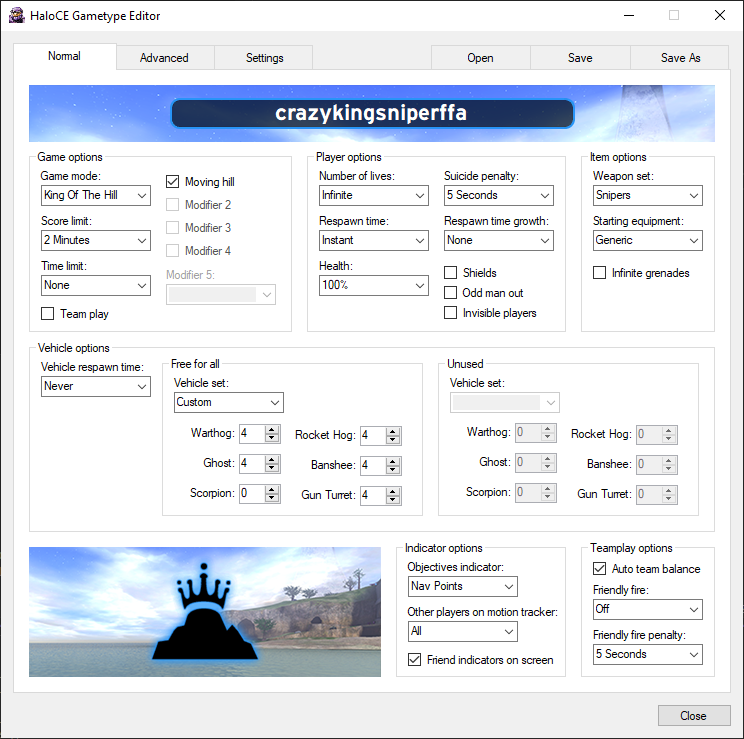
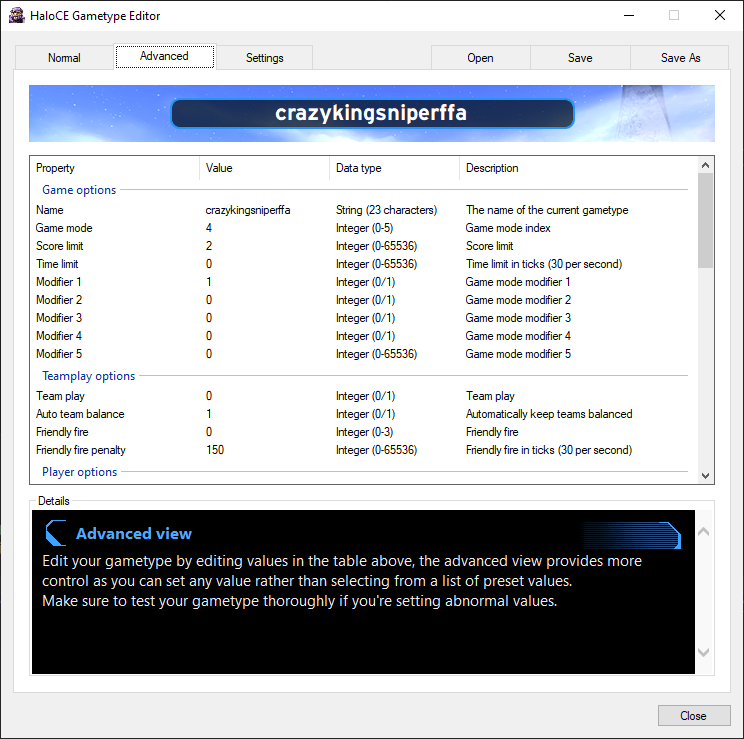
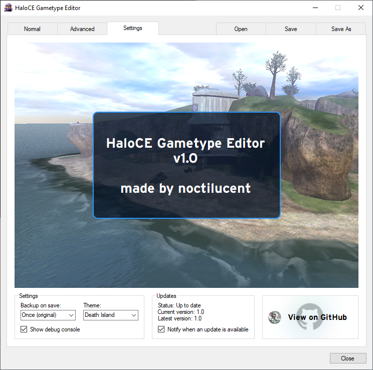

# 🎮 HaloCE Gametype Editor 🎮
A fully-featured gametype editor for Halo Custom Edition.

This tool was created to edit the native gametype format for Halo (blam.lst) with greater ease and flexibility.
It allows for custom values to be set, as well as fixing an issue the original game has when creating a Capture The Flag gametype where the score limit is always set to 1.

This tool provides great flexability by using the advanced tab, allowing custom values to be set for most variables.
Some things outside of these ranges will work fine, but some may have unintended consequnces; the details pages in the advanced view will be updated with more detailed information in time.

### 🌟 Features
- Edit Halo Custom Edition gametypes with a familiar interface
- Set custom values for any property
- Details page with information for each property (pulled live from Github)
- Update CRC check for modified/broken gametypes
- Automatic gametype backup
- Automatic update checking
- 7 different themes

### 🔗 Getting started
- Before you begin, please make sure you have at least 1 gametype saved in your HaloCE save game folder (usually located in C:\Users\User\Documents\My Games\Halo CE)
- [Download the latest verison of HaloCE Gametype Editor from GitHub releases](https://github.com/nocti1/HaloCE-Gametype-Editor/releases/latest)
- Run HaloCE.Gametype.Editor.exe and load your gametype, then edit away
- Once you've finished editing, you can save the file in place or as another file

### 🖥️ Interface

**Normal interface**

Edit gametypes with an interface that mimics the original game.

**Advanced interface**

Edit gametypes with a custom advanced interface.

**Information screen**

View information and settings.

Developed on Windows 10 with .NET Framework 4.7.2 for Halo Custom Edition 1.00.10.0621, but will likely work with other versions too.

### 📢 Feedback
If you can confirm it's working on a different version or you have a bug to report, please raise a GitHub issue, or message me on Discord: `nocti1`

### 🏆 Credits
Credit to Kybo_Ren, ZiON, and Thomas K for discovering the gametype's data structure and providing vehicle functions.

Created by noctilucent, using the above mentioned people's past work as reference.

Thx
