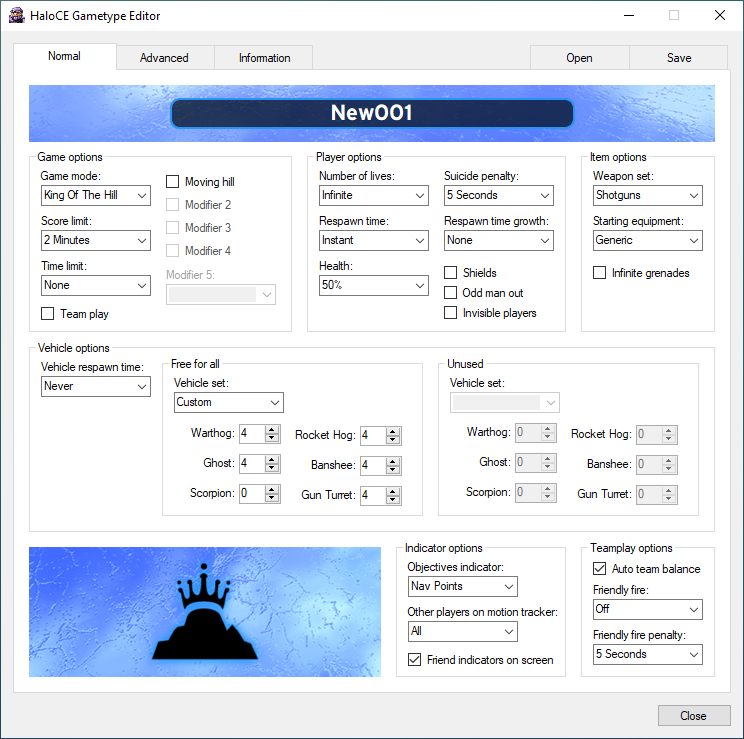
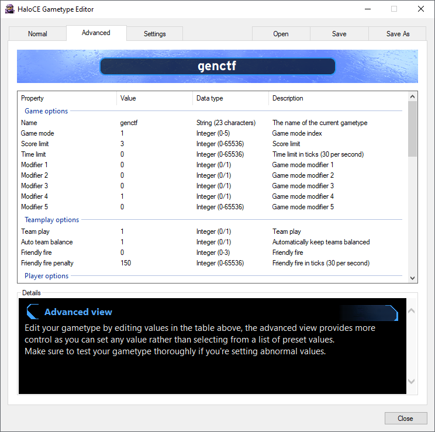
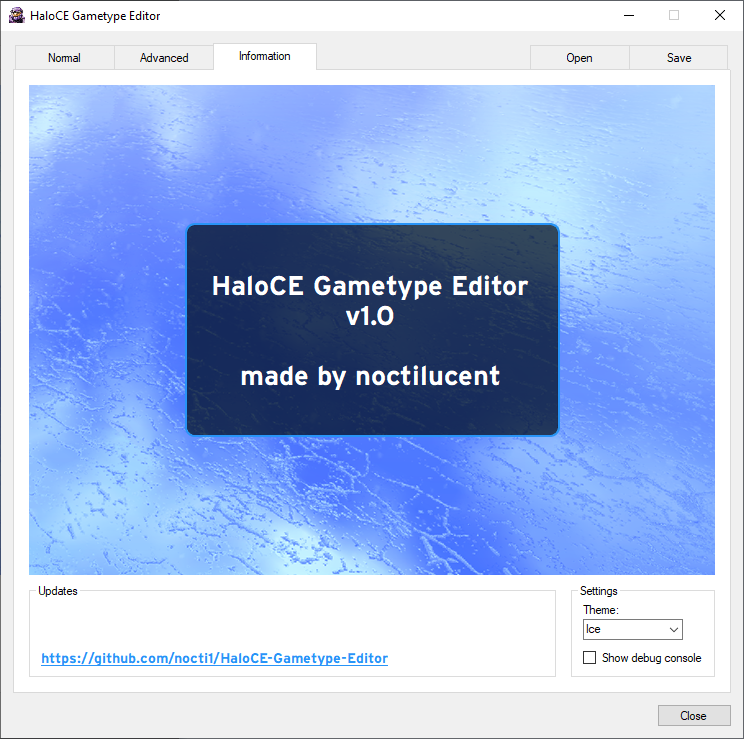

# HaloCE Gametype Editor
A fully-featured gametype editor for Halo Custom Edition.

This tool was created to edit the native gametype format for Halo (blam.lst) with greater ease and flexability.
It allows for custom values to be set as well as fixing an issue the original game has when creating a Capture The Flag gametype with a score limit higher than 1.

In the future I intend to implement a warnings system to notify you if you've set values outside of ranges that would be possible in the normal game.
Some things outside of these ranges will work fine but some may have unintended consequnces, the details pages in the advanced view will be updated with more detailed information in time as it's discovered.

HaloCE Gametype Editor features 2 main viewing modes: a normal view (an interface that mimics the original game), and the advanced view, which allows you to set almost any value in most fields. 

#### Normal interface
Edit gametypes with an interface that mimics the original game.

#### Advanced interface
Edit gametypes with a custom advanced interface.

#### Information screen
View information and settings.

Developed and tested with Halo Custom Edition 1.00.10.0621, but will likely work with other versions too.

If you can confirm it's working on a different version or you have a bug to report, please raise a GitHub issue, or message me on Discord: `nocti1`

Release date: `soon`

Thx